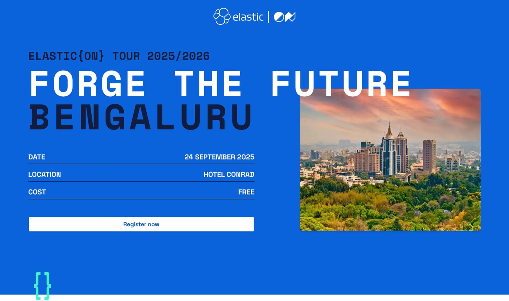
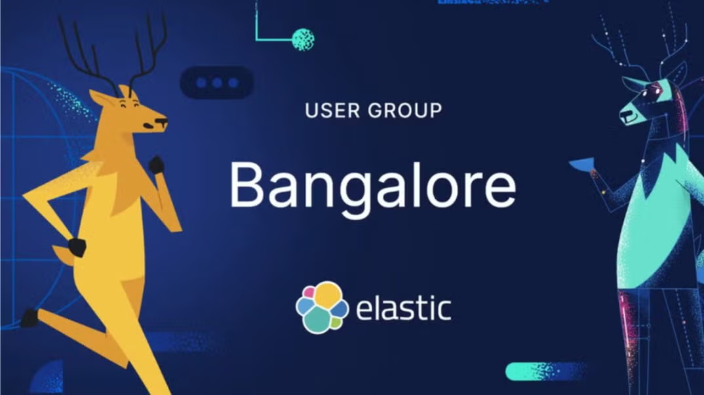

# Hey, I'm *[Anchal Sharma](https://www.linkedin.com/in/anchal-sharma-a5256693/)* 👋 

----
### About Me

A `Support Engineer` at `Elastic`, based in `Bangalore`.

I’m passionate about helping developers and organizations get the most out of Elasticsearch, whether it’s powering real-time search, observability, or security use cases. 

I love working at the intersection of data, performance, and user experience, especially when integrating tools with Elastic Stack to build robust, real-time pipelines.

----

Event: **Apache Kafka® Meetup – Bangalore**  
📍 **Date**: 26th July 2025  
📍 **Location**: Bangalore  

----

#### I'm Talking About - `From Real-time Kafka events to Elasticsearch insights`. 

Go thorugh below Repo for Slides, Configuration files, Setup and other info of this topic. 

**REPO-** [Kafka-Elasticsearch-KELK](https://github.com/AnchalSharma-dev/Kafka-Elasticsearch-KELK.git)

----

## 🔧 For Developers

Looking to explore Elasticsearch on your own?

- Try it out locally in just a few minutes:  
  👉 [github.com/elastic/start-local](https://github.com/elastic/start-local)  
  A great way to play around and get hands-on with Elasticsearch!

- Want something more advanced?  
  Dive into **Elasticsearch Labs** for hands-on experiences across **GenAI**, **Search**, **Observability**, and **Security** use cases.  
  👉 [elastic.co/search-labs](https://www.elastic.co/search-labs)  
  *Search news, experiments, and research from the creators of Elasticsearch.*

---

## 🎉 ElasticON Bangalore

**ElasticON Bangalore** is happening on **September 24th, 2025**  
📌 [Click here to Register!](https://www.elastic.co/elasticon)  

🎤 **Call for Speakers**:  
Interested in sharing your Elasticsearch use case?  
👉 [Submit your talk here](https://sessionize.com/elasticon-tour/)

---

## 🔗 Stay Connected

👥 Connect with me on [LinkedIn](https://www.linkedin.com/in/anchal-sharma-a5256693/)  

📅 Join our [Elastic Meetup Group – Bangalore](https://www.meetup.com/elasticsearch-explorers/events/308604911/)  

Be part of the growing community, attend more meetups, and stay in the loop!

---

Thanks for stopping by! See you at the meetup! ✨
